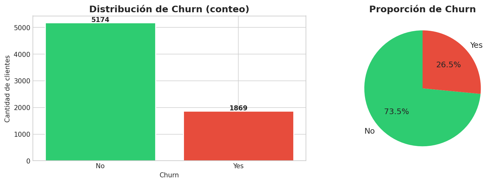
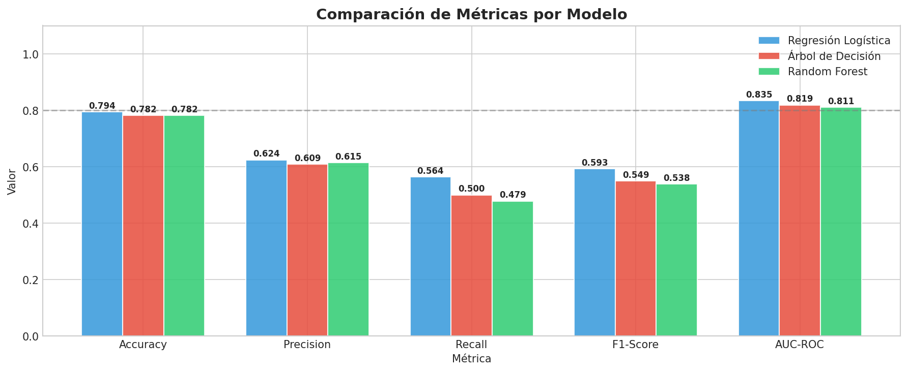
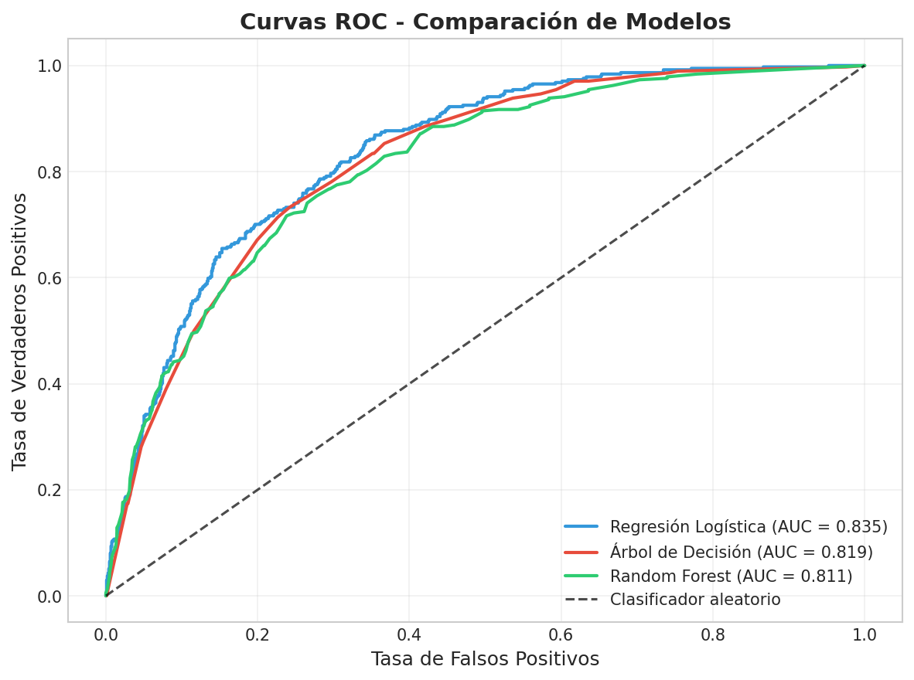
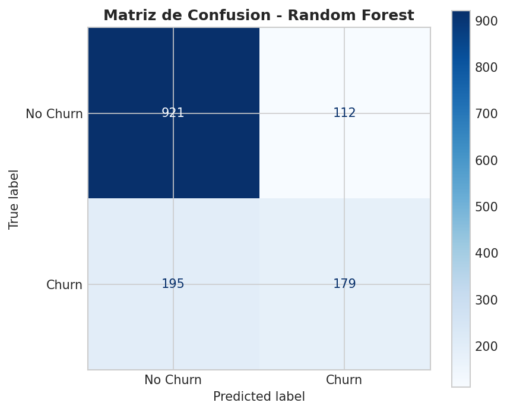
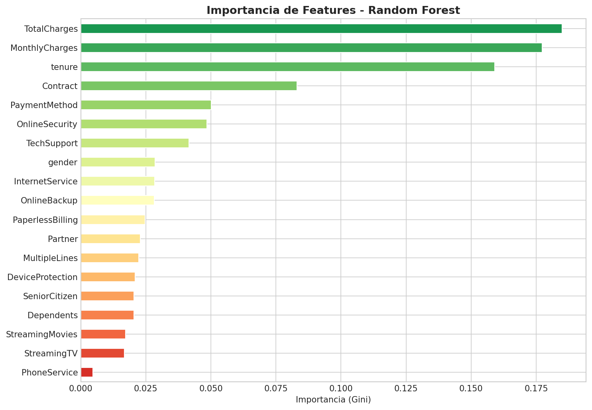

# Predicción de Churn en Telecomunicaciones
### Proyecto Curso I — Especialización Machine Learning Engineering

---

## Tabla de Contenidos

1. [Problema de ML](#1-problema-de-ml)
2. [Diagrama de Flujo](#2-diagrama-de-flujo-del-proyecto)
3. [Dataset y Diccionario de Datos](#3-dataset-y-diccionario-de-datos)
4. [Model Card](#4-model-card)
5. [Resultados y Métricas](#5-resultados-y-métricas)
6. [Conclusiones](#6-conclusiones)
7. [Estructura del Repositorio](#7-estructura-del-repositorio)
8. [Instrucciones de Ejecución](#8-instrucciones-de-ejecución)

---

## 1. Problema de ML

### Contexto de Negocio

Una empresa de telecomunicaciones busca **reducir la tasa de abandono (churn)** de clientes. Cada cliente perdido representa un costo significativo en adquisición. El objetivo es identificar, con anticipación, qué clientes tienen alta probabilidad de cancelar su servicio para tomar acciones de retención proactivas.

### Definición del Problema

| Componente | Descripción |
|-----------|-------------|
| **Tipo** | Aprendizaje Supervisado |
| **Subproblema** | Clasificación Binaria |
| **Variable objetivo** | `Churn` — ¿El cliente abandonó? (1=Sí / 0=No) |
| **Hipótesis** | El tipo de contrato, la antigüedad y los cargos mensuales son los principales predictores de churn |
| **Impacto** | Reducir churn en 5% equivale a un aumento significativo en ingresos anuales |

### Métricas seleccionadas

- **AUC-ROC**: Métrica principal. Mide la capacidad discriminativa del modelo independientemente del umbral.
- **Recall (sensibilidad)**: Crítico en este contexto — es más costoso *no detectar* un cliente en riesgo que tener un falso positivo.
- **F1-Score**: Balance entre Precision y Recall.
- **Accuracy**: Métrica de referencia general.

---

## 2. Diagrama de Flujo del Proyecto

```
┌─────────────────────────────────────────────────────────────────┐
│                    PIPELINE ML - CHURN PREDICTION               │
└─────────────────────────────────────────────────────────────────┘

 ┌──────────┐    ┌──────────────┐    ┌────────────────┐
 │  Dataset │───▶│     EDA      │───▶│  Limpieza de   │
 │  CSV     │    │  Exploración │    │    Datos       │
 └──────────┘    └──────────────┘    └───────┬────────┘
                                             │
                                             ▼
                                    ┌────────────────┐
                                    │  Codificación  │
                                    │  Categóricas   │
                                    │ (LabelEncoder) │
                                    └───────┬────────┘
                                             │
                                             ▼
                                    ┌────────────────┐
                                    │    División    │
                                    │  80% / 20%     │
                                    │  (Estratif.)   │
                                    └───────┬────────┘
                                             │
                                             ▼
                                    ┌────────────────┐
                                    │   Escalado     │
                                    │ StandardScaler │
                                    └───────┬────────┘
                                             │
                          ┌──────────────────┼──────────────────┐
                          ▼                  ▼                  ▼
                 ┌──────────────┐  ┌──────────────┐  ┌──────────────┐
                 │  Regresión   │  │   Árbol de   │  │    Random    │
                 │  Logística   │  │  Decisión    │  │    Forest    │
                 └──────┬───────┘  └──────┬───────┘  └──────┬───────┘
                        └─────────────────┼─────────────────┘
                                          ▼
                                 ┌────────────────┐
                                 │  Evaluación y  │
                                 │  Comparación   │
                                 │ (AUC, F1, etc) │
                                 └───────┬────────┘
                                          │
                          ┌───────────────┴──────────────┐
                          ▼                              ▼
                 ┌────────────────┐            ┌────────────────┐
                 │  Mejor Modelo  │            │   LLM (Groq)   │
                 │  Guardado      │            │  Explicaciones │
                 │  (.pkl)        │            │  de Negocio    │
                 └────────────────┘            └────────────────┘
```

---

## 3. Dataset y Diccionario de Datos

### Fuente
- **Dataset:** IBM Telco Customer Churn
- **Origen:** [Kaggle - Telco Customer Churn](https://www.kaggle.com/datasets/blastchar/telco-customer-churn)
- **Registros:** 7,043 clientes
- **Características:** 20 variables + 1 target
- **Tamaño:** ~977 KB

### Diccionario de Datos

| Variable | Tipo | Descripción | Valores |
|----------|------|-------------|---------|
| `customerID` | string | Identificador único del cliente | ID alfanumérico |
| `gender` | categórica | Género del cliente | Male / Female |
| `SeniorCitizen` | binaria | ¿Es ciudadano mayor? | 0 / 1 |
| `Partner` | categórica | ¿Tiene pareja? | Yes / No |
| `Dependents` | categórica | ¿Tiene dependientes? | Yes / No |
| `tenure` | numérica | Meses como cliente | 0 – 72 |
| `PhoneService` | categórica | ¿Tiene servicio telefónico? | Yes / No |
| `MultipleLines` | categórica | ¿Múltiples líneas? | Yes / No / No phone |
| `InternetService` | categórica | Tipo de servicio de internet | DSL / Fiber optic / No |
| `OnlineSecurity` | categórica | ¿Tiene seguridad online? | Yes / No / No internet |
| `OnlineBackup` | categórica | ¿Tiene respaldo online? | Yes / No / No internet |
| `DeviceProtection` | categórica | ¿Tiene protección de dispositivo? | Yes / No / No internet |
| `TechSupport` | categórica | ¿Tiene soporte técnico? | Yes / No / No internet |
| `StreamingTV` | categórica | ¿Tiene streaming TV? | Yes / No / No internet |
| `StreamingMovies` | categórica | ¿Tiene streaming movies? | Yes / No / No internet |
| `Contract` | categórica | Tipo de contrato | Month-to-month / One year / Two year |
| `PaperlessBilling` | categórica | ¿Factura sin papel? | Yes / No |
| `PaymentMethod` | categórica | Método de pago | Electronic check / Mailed check / Bank transfer / Credit card |
| `MonthlyCharges` | numérica | Cargo mensual (USD) | 18.25 – 118.75 |
| `TotalCharges` | numérica | Cargo total acumulado (USD) | 18.80 – 8684.80 |
| `Churn` ⭐ | **target** | ¿El cliente se fue? | Yes (1) / No (0) |

### Estadísticas clave

| Estadística | Valor |
|-------------|-------|
| Clientes totales | 7,043 |
| Clientes que hicieron churn | 1,869 (26.5%) |
| Clientes que permanecieron | 5,174 (73.5%) |
| Promedio tenure | 32.4 meses |
| Promedio MonthlyCharges | $64.8 USD |
| Valores faltantes | 11 filas (TotalCharges) |

---

## 4. Model Card

### Información General

| Campo | Detalle |
|-------|---------|
| **Nombre del modelo** | Telco Churn Classifier — Logistic Regression |
| **Versión** | 1.0.0 |
| **Fecha** | Junio 2026 |
| **Tipo** | Clasificación binaria supervisada |
| **Framework** | scikit-learn 1.9.0 |
| **Lenguaje** | Python 3.14 |

### Uso previsto

- **Usuario objetivo:** Equipos de retención de clientes de telecomunicaciones
- **Caso de uso:** Identificar clientes en riesgo de abandono para intervención proactiva
- **Fuera de alcance:** No debe usarse para decisiones de crédito, contratación o acceso a servicios

### Datos de entrenamiento

| Componente | Detalle |
|-----------|---------|
| Dataset | IBM Telco Customer Churn |
| Registros entrenamiento | 5,625 (80%) |
| Registros prueba | 1,407 (20%) |
| División | Estratificada por clase objetivo |
| Preprocesamiento | LabelEncoder + StandardScaler |

### Rendimiento del Modelo (set de prueba)

| Métrica | Valor |
|---------|-------|
| Accuracy | 0.7939 |
| Precision | 0.6243 |
| Recall | 0.5642 |
| F1-Score | 0.5927 |
| **AUC-ROC** | **0.8345** |

### Consideraciones éticas y limitaciones

- **Desbalance de clases:** 73%/27% — el modelo puede sesgar predicciones hacia "No Churn"
- **Datos históricos:** El modelo refleja patrones pasados; puede degradarse con cambios de mercado
- **Variables proxy:** Algunos atributos (ej. `SeniorCitizen`) pueden actuar como proxies de características protegidas
- **Sin causalidad:** El modelo identifica correlaciones, no causas del churn

### Gráficas

| Visualización | Descripción |
|--------------|-------------|
|  | Distribución de la variable objetivo |
|  | Comparación de métricas por modelo |
|  | Curvas ROC de los 3 modelos |
|  | Matriz de confusión - Regresión Logística |
|  | Importancia de features - Random Forest |

---

## 5. Resultados y Métricas

### Métricas de Evaluación Offline

| Modelo | Accuracy | Precision | Recall | F1-Score | AUC-ROC |
|--------|----------|-----------|--------|----------|---------|
| Regresión Logística ⭐ | 0.7939 | 0.6243 | 0.5642 | 0.5927 | **0.8345** |
| Árbol de Decisión | 0.7818 | 0.6091 | 0.5000 | 0.5492 | 0.8186 |
| Random Forest | 0.7818 | 0.6151 | 0.4786 | 0.5383 | 0.8107 |

**Modelo seleccionado:** Regresión Logística (mejor AUC-ROC: 0.8345)

> **Observación importante:** La Regresión Logística superó a Random Forest en AUC-ROC y F1-Score. Esto sugiere que las relaciones entre las variables y el churn son principalmente lineales (o pueden ser capturadas linealmente tras el escalado), lo que es un hallazgo valioso para el negocio: los factores de churn son interpretables directamente desde los coeficientes del modelo.

### Métricas de Evaluación Online (propuesta)

Para evaluar el modelo en producción se propone un **experimento A/B**:

| Grupo | Descripción | Métrica a medir |
|-------|-------------|-----------------|
| Control | Sin intervención (proceso actual) | Tasa de churn mensual |
| Tratamiento | Intervención proactiva en clientes con P(churn) > 0.5 | Tasa de churn mensual |

**KPIs online:**
- **Tasa de retención:** % clientes identificados como churn que permanecen tras intervención
- **ROI de la campaña:** (Ingresos retenidos) / (Costo de intervención)
- **Lift del modelo:** Comparación entre tasa de churn del grupo tratado vs. control

---

## 6. Conclusiones

1. **La Regresión Logística es el mejor modelo** para este problema (AUC-ROC: 0.834), demostrando que la simplicidad y la interpretabilidad pueden superar a modelos más complejos cuando los datos tienen relaciones predominantemente lineales.

2. **Variables críticas de churn:**
   - `tenure` — clientes con < 12 meses de antigüedad tienen 3x más riesgo de churn
   - `Contract` — contratos mes a mes tienen tasa de churn del ~43% vs. ~3% en contratos anuales
   - `MonthlyCharges` — cargos > $70/mes correlacionan con mayor propensión al abandono
   - `TechSupport` y `OnlineSecurity` — la ausencia de estos servicios aumenta el riesgo

3. **Integración LLM:** El uso de LLaMA 3.3-70B (Groq) demostró que los LLMs pueden transformar predicciones técnicas en recomendaciones accionables para equipos no técnicos, aumentando significativamente el valor de negocio del modelo.

4. **Desafíos identificados:**
   - El desbalance de clases (73/27) limita el Recall del modelo para la clase minoritaria (Churn)
   - Para mejorar el Recall se recomienda aplicar técnicas como SMOTE o ajuste de threshold en una versión futura

5. **Próximos pasos:**
   - Implementar SMOTE para balancear clases y mejorar Recall
   - Evaluar modelos de gradient boosting (XGBoost, LightGBM)
   - Crear un endpoint de API REST para predicciones en tiempo real
   - Implementar monitoreo de drift del modelo en producción

---

## 7. Estructura del Repositorio

```
Project-MLEngineer/
├── README.md                          # Este archivo
├── requirements.txt                   # Dependencias del proyecto
├── .gitignore                         # Archivos excluidos del repositorio
│
├── notebooks/
│   ├── 01_preprocessing.ipynb        # EDA y preprocesamiento de datos
│   └── 02_ml_llm.ipynb               # Modelos ML + integración LLM
│
├── data/
│   ├── .gitkeep
│   └── WA_Fn-UseC_-Telco-Customer-Churn.csv   # Dataset (no versionado en git)
│
├── artifacts/
│   ├── .gitkeep
│   ├── logistic_regression_model.pkl  # Mejor modelo entrenado
│   ├── random_forest_model.pkl        # Modelo Random Forest
│   ├── scaler.pkl                     # Escalador entrenado
│   ├── label_encoders.pkl             # Encoders de variables categóricas
│   ├── processed_data.pkl             # Datos preprocesados (train/test)
│   ├── model_metrics.json             # Métricas de todos los modelos
│   ├── churn_distribution.png         # Gráfica distribución de churn
│   ├── categorical_churn_rates.png    # Tasas de churn por categoría
│   ├── correlation_matrix.png         # Matriz de correlación
│   ├── metrics_comparison.png         # Comparación de métricas
│   ├── roc_curves.png                 # Curvas ROC
│   ├── confusion_matrix.png           # Matriz de confusión
│   └── feature_importance.png         # Importancia de features
│
├── src/
│   ├── __init__.py
│   ├── preprocessor.py               # Clase ChurnPreprocessor (reutilizable)
│   └── trainer.py                    # Clase ModelTrainer (reutilizable)
│
├── scripts/
│   ├── preprocess.py                 # Script de preprocesamiento
│   ├── train.py                      # Script de entrenamiento
│   ├── predict.py                    # Script de predicción
│   └── generate_artifacts.py        # Script para generar todos los artefactos
│
└── docs/
    └── git_strategy.md               # Documentación de estrategia Git
```

---

## 8. Instrucciones de Ejecución

### Requisitos previos

- Python 3.10+
- Cuenta en [Groq](https://console.groq.com) con API key gratuita

### Configuración

```bash
# 1. Clonar el repositorio
git clone https://github.com/richardmk/Project-MLEngineer.git
cd Project-MLEngineer

# 2. Instalar dependencias con uv (recomendado)
uv sync

# 3. Configurar API key
echo "GROQ_API_KEY=tu_api_key_aqui" > .env
```

> **uv** gestiona automáticamente el entorno virtual y las dependencias desde `pyproject.toml`.
> Instálalo con: `curl -LsSf https://astral.sh/uv/install.sh | sh`

### Ejecución con scripts

```bash
# Preprocesar datos
uv run python scripts/preprocess.py --input data/WA_Fn-UseC_-Telco-Customer-Churn.csv

# Entrenar modelo
uv run python scripts/train.py --model logistic_regression

# Generar predicciones
uv run python scripts/predict.py --input data/WA_Fn-UseC_-Telco-Customer-Churn.csv

# Generar todos los artefactos de una vez
uv run python scripts/generate_artifacts.py
```

### Ejecución de notebooks

```bash
# Lanzar Jupyter
uv run jupyter notebook notebooks/
```

Ejecutar en orden:
1. `01_preprocessing.ipynb` — EDA y preprocesamiento
2. `02_ml_llm.ipynb` — Modelos ML y análisis LLM

---

*Proyecto desarrollado para el Curso I de la Especialización en Machine Learning Engineering*
